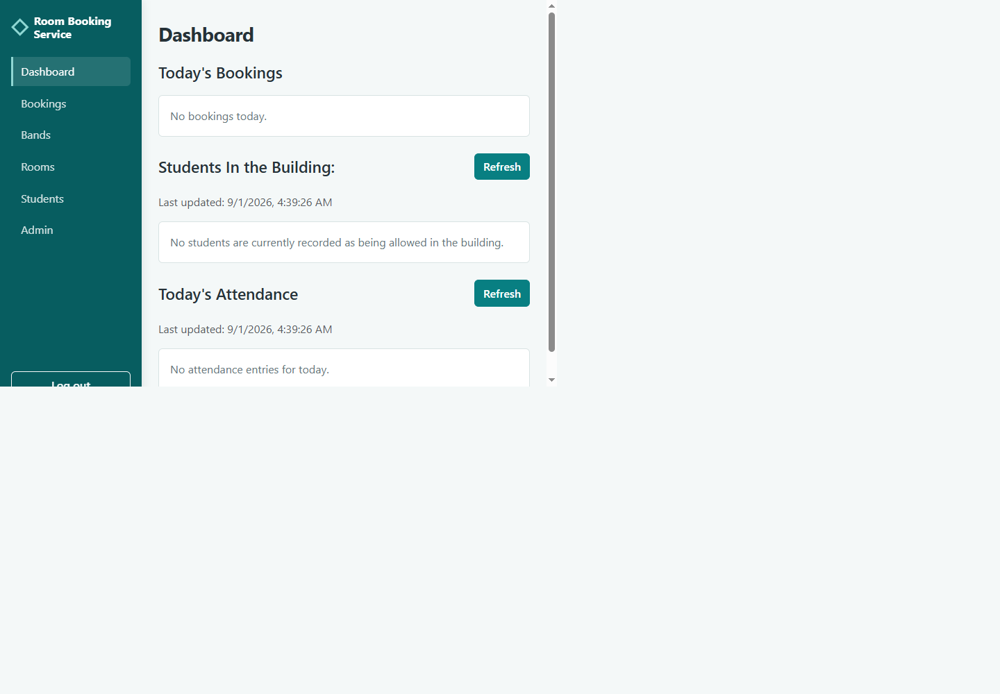
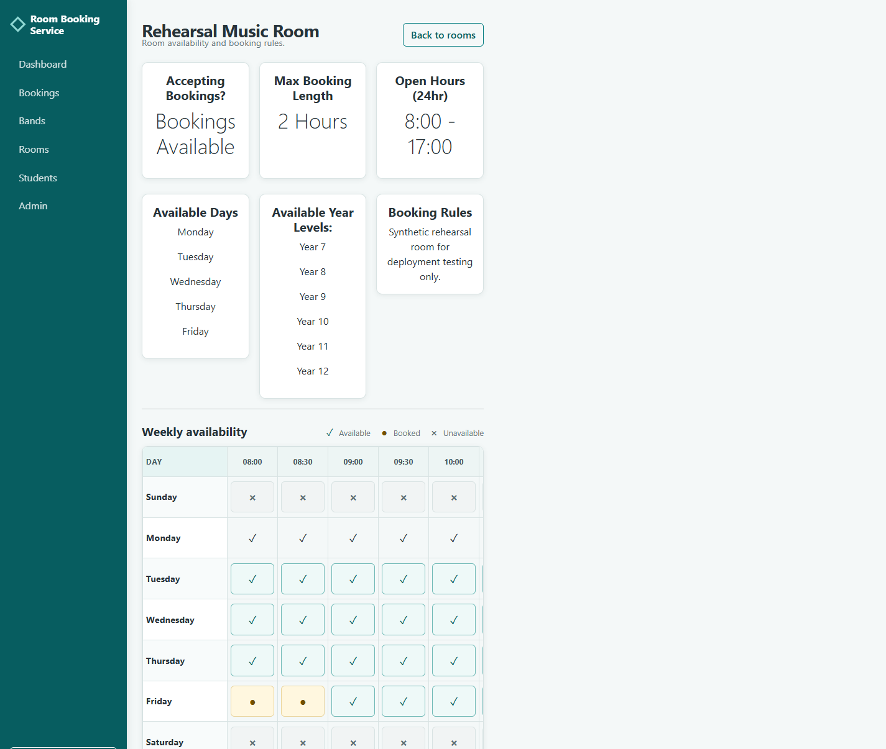
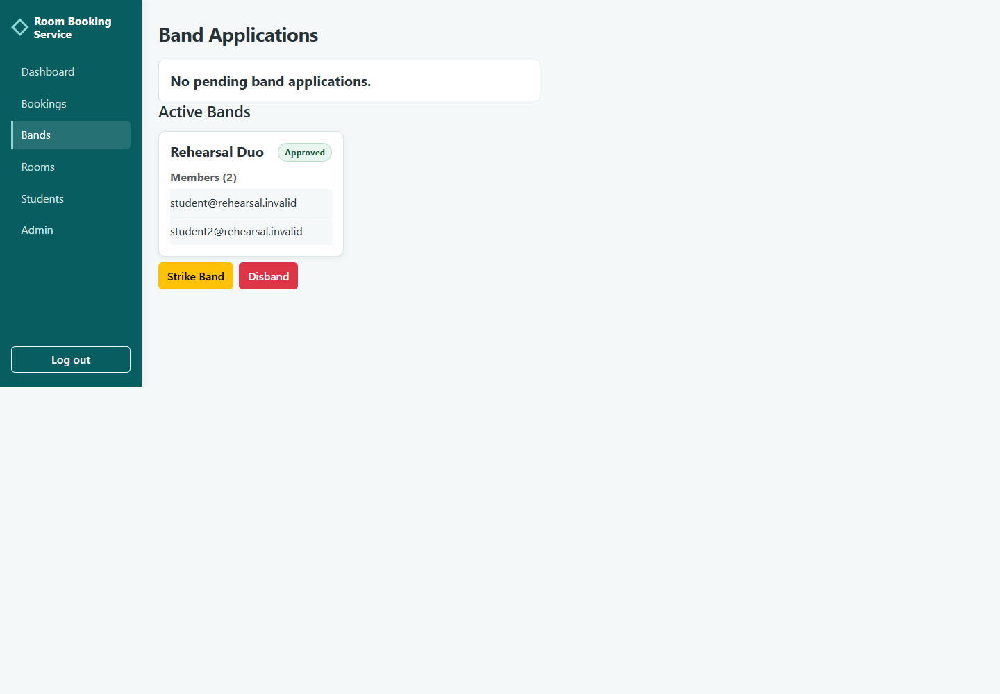
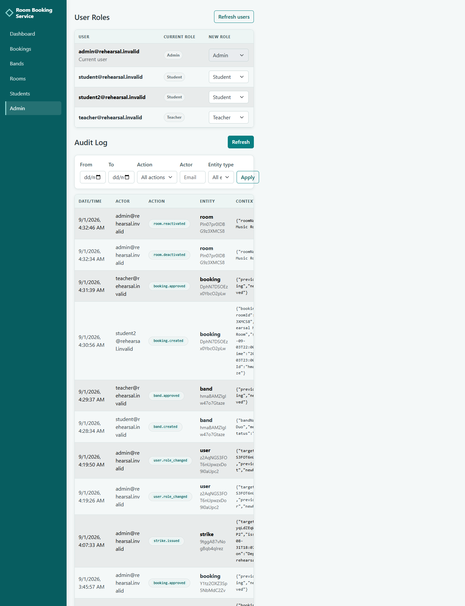

# School Room Booking System

A full-stack room booking and attendance management system designed around the practical requirements of a secondary-school environment.

## Overview

The School Room Booking System gives students a structured way to find suitable rooms and request bookings, while giving teachers and administrators tools for approvals, room rules, student attendance, discipline, and audit review.

The project was developed around a real-world school workflow without exposing the identity of the school or the people involved. Its design focuses on requirements-driven development, backend validation, role-based access control, school-level data isolation, and a responsive user experience.

The application has three user roles:

- **Students** can search for rooms, create solo or band bookings, manage bands, and view their strike status.
- **Teachers** can approve bookings and bands, manage student strikes, and record attendance.
- **Administrators** have teacher capabilities plus room administration, user role administration through the backend, and access to the audit viewer.

## Key Features

### Authentication & Access Control

- Firebase Authentication with email/password sign-in.
- Student, teacher, and administrator roles.
- Backend-authoritative role-based access control.
- Firebase ID token verification on protected API requests.
- School-level isolation for users, rooms, bookings, bands, strikes, and audit records.
- School assignment during student registration based on the configured email domain.

### Room Management

- Room creation and editing for authorised administrators.
- Configurable opening and closing hours.
- Allowed weekdays and year-level restrictions.
- Room-specific maximum booking duration.
- Room usage agreements shown during booking.
- Availability search based on the requested time, room rules, year level, and existing bookings.
- Soft deactivation and reactivation.

Deactivation preserves the room document and historical booking references. It changes the room's bookable state rather than hard-deleting the room.

### Booking

- 30-minute start and end boundaries.
- Variable durations in 30-minute increments, including 30, 60, and 90 minutes.
- Room-specific maximum duration enforcement.
- Opening-hours and allowed-day validation.
- Server-side overlap detection during creation and approval.
- Room-specific approval requirements.
- Weekly student booking rules:
  - an eligible first solo booking may be automatically approved;
  - a second solo booking is waitlisted;
  - bookings beyond the weekly limit are rejected;
  - band bookings enter the staff approval workflow.
- Staff bookings are automatically approved.
- Staff approval and denial of pending and waitlisted bookings.
- Booking statuses: `approved`, `pending`, `waitlisted`, `denied`, and `cancelled`.

- Students can cancel eligible future bookings; cancelled bookings remain in history and no longer block availability.

### Bands

- Student band creation.
- Member selection and minimum membership validation.
- Same-school and student-role validation for members.
- Duplicate band name and duplicate member-set prevention.
- Staff approval and denial.
- Approved-band bookings.
- Band disbanding by authorised staff or the band creator.
- Leaving an approved band as a non-creator member.
- Band strikes applied as individual strike records to current members.

### Strikes & Temporary Bans

- Individual student strikes.
- Band strikes applied individually to members.
- Seven-day strike expiry.
- Student warning state for an active strike.
- Temporary booking bans when strikes overlap.
- Student-visible strike and ban status.
- Server-side prevention of new bookings while banned.

This is a rule-driven strike and ban workflow rather than a configurable disciplinary platform.

### Rollcall & Attendance

- **Current Rollcall** for currently active approved bookings.
- **Today's Attendance** for approved bookings that started today and remain within the editable attendance window.
- Present/Absent tracking.
- Independent attendance records for each booking/student combination.
- Same-day post-booking attendance updates.
- Attendance persistence in Firestore.
- Attendance marking and status-change audit events.

Attendance updates are restricted to authorised staff, approved bookings, associated students, the booking's calendar day, and times after the booking has started.

### Administration & Auditing

- Room administration, including deactivation and reactivation.
- Protected backend endpoint for user role administration.
- Append-only audit logging for important mutations.
- Admin-only audit viewer.
- Date, action, actor, and entity-type filters.
- Cursor-based audit pagination.

## Screenshots

The following screenshots are from the deployed rehearsal application and use synthetic data only:









## Architecture

```text
Vue frontend
    |
    | Firebase ID token / Axios requests
    v
Express backend
    |
    | Authentication middleware
    | RBAC / server-side validation
    | Service layer
    v
Firebase Admin SDK
    |
    v
Firestore
```

The frontend uses Vue views and components with Vue Router for navigation, Pinia for authentication state, Axios for API requests, and Bootstrap for responsive layout and controls.

The backend uses Express route handlers, authentication middleware, RBAC helpers, and service modules for domain operations. The active API handlers are registered primarily in `backend/src/index.ts`; the repository should not be described as a fully separated controller/router architecture.

## Environment Configuration

Frontend Firebase web configuration and the backend API URL are supplied through Vite variables. Copy `frontend/.env.example` to `frontend/.env.local` and provide the developer Firebase web configuration and `VITE_API_BASE_URL=http://localhost:3000`. Production uses the school's Firebase web configuration and deployed backend URL in the school's deployment environment.

Backend local configuration is supplied through `backend/.env`, based on `backend/.env.example`. `CORS_ALLOWED_ORIGINS` accepts a comma-separated allowlist. The ignored `serviceAccountKey.json` is used locally when present, while Google-managed production runtimes use Application Default Credentials and do not require that file. Set `TZ=Australia/Melbourne` for the school's IANA timezone. Tests explicitly use UTC through the backend `npm test` script.

Firebase Authentication handles user identity. The backend verifies Firebase ID tokens, loads the corresponding user profile, applies role and school checks, validates business rules, and persists data through the Firebase Admin SDK and Firestore.

## Technology Stack

### Frontend

- Vue `3.5.32`
- TypeScript `6.0.2`
- Vite `8.0.10`
- Pinia `3.0.4`
- Vue Router `5.0.6`
- Bootstrap `5.3.8`
- Axios `1.15.2`
- Firebase client SDK `12.12.1`

### Backend

- Node.js
- Express `5.2.1`
- TypeScript `6.0.3`
- Firebase Admin SDK `13.8.0`
- Firestore
- `ts-node-dev` `2.0.0`
- `dotenv` `17.4.2` is included as a backend dependency.

## Security Design

The application uses the following security decisions:

- Firebase Authentication establishes user identity.
- Firebase ID tokens are sent with API requests and verified by the backend.
- Authorization is backend-authoritative; frontend visibility checks are not the security boundary.
- RBAC protects booking approval, room administration, student management, attendance, and audit operations.
- Server-side validation enforces room, booking, band, attendance, and strike rules.
- `schoolId` checks isolate school data and prevent cross-school operations.
- Administrative operations require the appropriate backend permission.
- Audit actor identity is derived from the authenticated backend request rather than accepted as a client-controlled field.
- Audit events are created as append-only Firestore records.
- Firebase service-account credentials are excluded from source control through `.gitignore`.

These controls describe the current design; production deployment would still require environment-specific hardening, monitoring, and operational review.

## Domain Model

- **School** stores school identity, permitted email domains, and student sign-up configuration.
- **User** represents a Firebase-authenticated person with a role, school, and optional year level.
- **Room** belongs to a school and contains bookability settings and room-specific rules.
- **Booking** references a room and its creator, optionally references a band, and stores its time interval, status, and approval information.
- **Band** belongs to a school, contains student member IDs, and moves through pending, approved, denied, and disbanded states.
- **Strike** belongs to a student and school, records its issuer and reason, and expires after seven days. Band strikes also retain the originating band ID.
- **Attendance** is stored per booking/student and records the current status, recording user, and update timestamps.
- **AuditEvent** records important mutations with the authenticated actor, school, entity, action, timestamp, and optional metadata.

The principal relationships are school-scoped: students, rooms, bookings, bands, strikes, and audit events carry a school association; bookings reference rooms and users or bands; and attendance is keyed to a booking/student pair.

## Booking Workflow

1. A student selects a date, time, duration, and booking type.
2. The backend validates the interval, room rules, year-level access, school association, strike status, and overlap conditions.
3. An eligible first solo booking of the week may be automatically approved.
4. A second solo booking is waitlisted, while band bookings and rooms requiring approval enter the staff workflow.
5. Staff can approve or deny pending and waitlisted requests after the backend revalidates the interval and collision state.
6. Approved bookings appear in room availability, Rollcall, and attendance workflows according to their time and date.

Staff-created bookings bypass the student approval rules and are automatically approved.

## Local Development Setup

### Prerequisites

- Node.js and npm.
- A Firebase project with Firebase Authentication and Firestore enabled.
- A local Firebase Admin service-account credential for the backend.

Clone the repository and install dependencies separately for each application:

```bash
git clone <repository-url>
cd school-room-booking-system

cd backend
npm install

cd ../frontend
npm install
```

### Backend

Create `backend/.env` from `backend/.env.example`. The backend uses `http://localhost:3000` and allows the local frontend origin by default. Supply the ignored `serviceAccountKey.json` locally when using a developer Firebase project, or configure local Application Default Credentials. Do not commit credentials.

Start the backend development server:

```bash
cd backend
npm run dev
```

### Frontend

Create `frontend/.env.local` by copying `frontend/.env.example`. Populate all six `VITE_FIREBASE_*` variables with the web configuration for your own development Firebase project and set `VITE_API_BASE_URL=http://localhost:3000`. The application reports the exact missing variable names if required configuration is absent. Do not copy live project identifiers or credentials into public documentation.

Start the frontend development server:

```bash
cd frontend
npm run dev
```

Create a production frontend build with:

```bash
npm run build
```

The build runs Vue/TypeScript validation through `vue-tsc` before invoking Vite.

## Deployment Preparation

The backend production artifact is built with `npm run build` and started with `npm run start`; the latter runs `node dist/index.js` and does not require `ts-node-dev`. `backend/Dockerfile` builds that artifact in a separate stage and copies only compiled output and production dependencies into the runtime image. `backend/.dockerignore` excludes local environment files and service-account keys.

Firebase Hosting is configured in `firebase.json` to serve the Vite output at `frontend/dist` and rewrite non-file routes to `index.html` for Vue Router. No `.firebaserc` is committed, so the deployment target must be selected explicitly with the Firebase CLI, for example `firebase deploy --project <developer-project-id>`. Use a separate developer/test Firebase project for rehearsal; never use school production identifiers or data during rehearsal.

Before a production build, provide the frontend variables from `frontend/.env.local` or the hosting build environment. Cloud Run should receive `PORT`, `CORS_ALLOWED_ORIGINS`, and `TZ=Australia/Melbourne` through runtime configuration, with the school's actual frontend origin supplied only at deployment time.

The eventual Cloud Run service should use a dedicated service account owned by the school. The current backend uses Firebase Admin to verify ID tokens and read/write Firestore; the runtime identity therefore needs the least-privilege Firestore data access role required by the school's chosen IAM policy (typically `roles/datastore.user`). Token verification does not require a distributed JSON key or Firebase Authentication data-management permissions. Review the final permissions with the school before granting them.

The checked-in `firestore.indexes.json` contains the composite indexes required by the current audit, booking, room, band, user, and strike query shapes. Deploy them with `firebase deploy --only firestore:indexes --project <project-id>` and wait until every index is Ready/Enabled.

The deployment was rehearsed successfully in a separate Firebase project using synthetic data. Firebase Hosting and Cloud Run are supported deployment targets. Environment separation keeps local development, rehearsal, and eventual school production configuration distinct; the rehearsal project is not production. School provisioning is documented in [DEPLOYMENT.md](DEPLOYMENT.md).

## Testing

### Frontend

The frontend build performs the available Vue/TypeScript project check:

```bash
cd frontend
npm run build
```

The current build completes successfully.

### Backend

The backend includes focused tests for:

- band member validation;
- booking time boundaries and durations;
- booking date-range calculations;
- room availability and half-hour cells;
- strike warning and ban logic;
- booking interval overlap behavior.

Run them with:

```bash
cd backend
npm test
```

The rehearsal backend regression suite completes with 56 passing tests and 0 failures. There is no committed integration or end-to-end test suite; cloud acceptance testing is documented in `DEPLOYMENT.md`.

## Project Status

The core application feature set is implemented, including authentication, RBAC, school isolation, room management, room availability, booking approval workflows, bands, strikes, attendance, responsive views, and audit review.

The frontend production build currently passes. Remaining work is environment-specific production provisioning, operational hardening, and optional feature extensions rather than the original core workflow.

This project is not presented as a finished commercial SaaS product or as generally production-ready without further operational review.

## Known Limitations & Future Improvements

- Add integration and end-to-end tests.
- Add email or in-application notifications.
- Improve concurrency protection around simultaneous booking conflicts.
- Add historical attendance and reporting views.
- Complete school production monitoring and operational hardening.
- Evaluate broader multi-school hosted deployment requirements.

These items are future improvements and do not prevent the current core application workflow from functioning.

## Project Context

This system was built as a practical full-stack software-engineering project around a secondary-school room-booking problem. The work involved translating real workflow requirements into domain models, backend validation, authentication and authorization rules, school data isolation, responsive UI patterns, attendance persistence, and auditable administrative actions.

## License

This repository uses the custom **School Room Booking System Free Use Licence**, which is source-available and is not an open-source licence. It permits free use by schools, educational organisations, and other recipients, but does not permit modification, derivative works, forks, or redistribution of modified versions without written permission. See [LICENSE](LICENSE) for the complete terms. Production deployment remains subject to the school's operational review and any required legal review.
